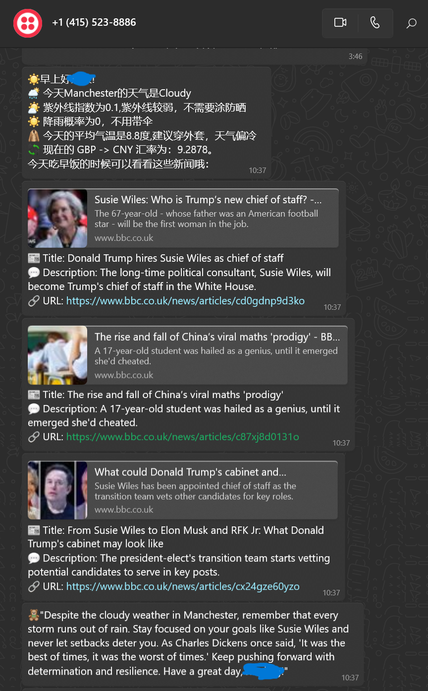
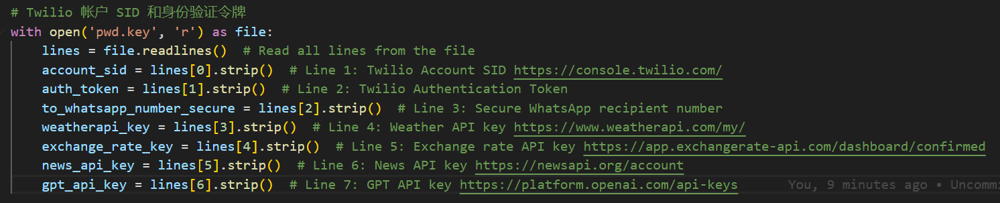
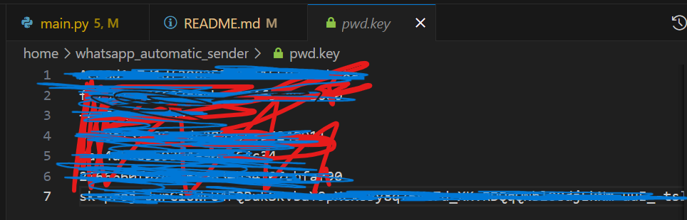

# whatsapp_automatic_sender

🤖 **WhatsApp Automatic Sender**: A Python script that sends automatic WhatsApp messages to a specified number daily 📱. The message content is customized using the GPT API 🤯, with additional dynamic information like weather 🌤️, news 📰, or exchange rates 💱.

## Badges


<!--  -->



## Features

- **Daily Automatic Messaging**: Sends messages daily to a target WhatsApp number.
- **GPT-powered Customization**: Injects dynamic, personalized content into messages.
- **Easy Configuration**: Set up your API keys in a simple configuration file (`pwd.key`).
- **Secure**: Sensitive data is kept secure and can be excluded from version control.

## Installation

1. Clone the repository:
   ```bash
   git clone https://github.com/yushiran/whatsapp_automatic_sender.git
   ```
2. Create Conda environment:
    ```
    conda env create -f ./env/environment.yml
    conda activate jwhatsapp
    ```
3. Setup pwd.key file
    ```
    Through the main.py file to access the api key from the offical website, and add them to pwd.key(you need to create the file by your own) file one by one.
    ```
    
    *Show the need of api*

    
    *Show the pwd.key file*
4. Run the run.sh file
    ```
    ./run.sh
    ```
5. Finally Work!!!
    
    *final result*