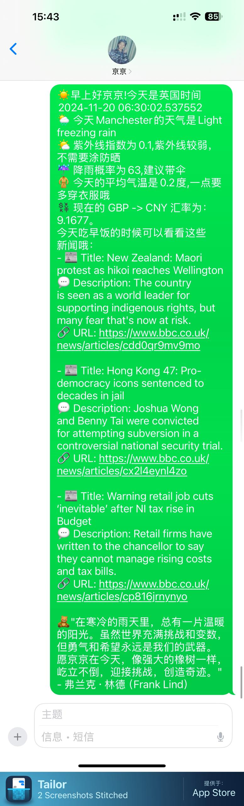
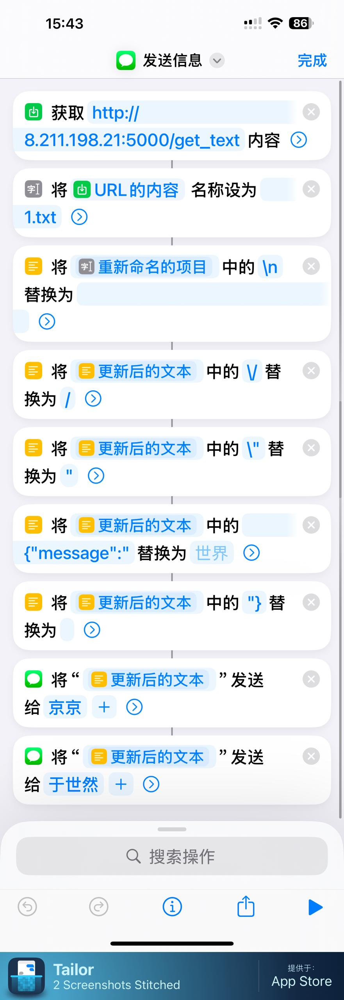

# message_automatic_sender

🤖 **Message Automatic Sender**: A Flask-based backend application that handles POST requests to send messages via **iPhone Shortcuts** 📱. The message content is dynamically generated using the GPT API 🤯, incorporating personalized elements like weather 🌤️, news 📰, or exchange rates 💱.

---

## Badges


---

{: width="100px" }


## Features

- **Flask Backend**: A lightweight backend built with Flask to handle POST requests for message content.
- **Dynamic Message Content**: Messages are generated dynamically using GPT API, enriched with contextual information (e.g., weather, news, exchange rates).
- **iPhone Shortcuts Integration**: Uses iPhone’s **Shortcuts app** to send messages, ensuring seamless communication.
- **Customizable**: API keys and other settings are easily managed via configuration files.

---

## Installation

1. Clone the repository:
   ```bash
   git clone https://github.com/yushiran/whatsapp_automatic_sender.git
   ```
2. Create Conda environment:
    ```
    conda env create -f ./env/environment.yml
    conda activate jwhatsapp
    ```
3. Setup pwd.key file
    ```
    Through the main.py file to access the api key from the offical website, and add them to pwd.key(you need to create the file by your own) file one by one.
    ```
    
    *Show the need of api*

    
    *Show the pwd.key file*
4. Run the run.sh file
    ```
    ./run.sh
    ```
5. Use this link to add the automation to your iphone
    https://www.icloud.com/shortcuts/6fe02f0c72cd4c11a2f65a1f522d38ec

    
